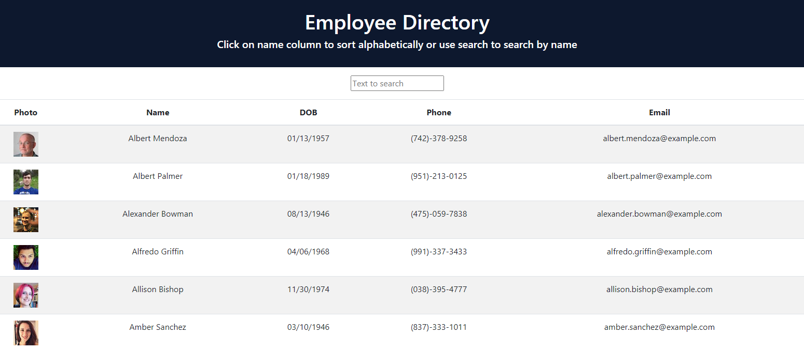

# React-Employee-Directory

  ## Description
  This is an employee directory with React. It breaks up your application's UI into components, manages component state, and responds to user events.

  Link to depolyed application: https://kmeersman624.github.io/React-Employee-Directory/

  

  ## Table of Contents
  * [Image](#image)
  * [Installation](#installation)
  * [Usage](#usage)
  * [License](#license)
  * [Contributing](#contributing)
  * [Questions](#questions) 

  ## Image

  

  ## Installation
  Given a table of random users, when the user loads the page, a table of employees should render. 

  The user can:

  * Search with input field

  * Filter the users by name.

  ## Usage
  As a user, I want to be able to view my entire employee directory at once so that I have quick access to their information.

  ## License
  © 2020 Kate Meersman brand. All Rights Reserved.

  

  ## Contributing
  Kate Meersman

  ## Questions
  * katie4682@yahoo.com